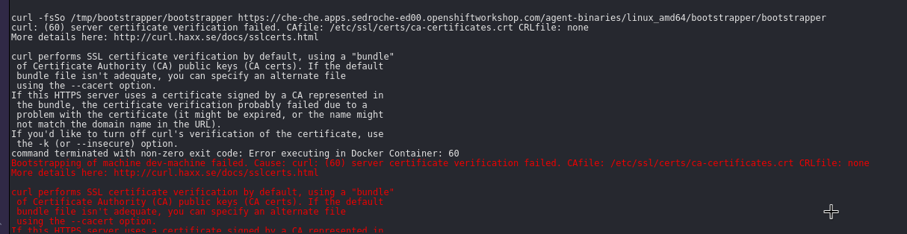

= My first Walkthrough

[type=walkthroughResource]
.My resource
****
* link:https://google.com[Helpful link, window="_blank"]
****

OpenShift App Host: {openshift-app-host}

Che URL: {che-url}.

Fuse URL: {fuse-url}

Launcher URL: {launcher-url}

API Management URL: {api-management-url}

AMQ URL: {amq-url}

AMQ Broker URL: {amq-broker-tcp-url}

AMQ Credential Username: {amq-credentials-username}

AMQ Credential Password: {amq-credentials-password}

EnMasse URL: {enmasse-url}

EnMasse Broker URL: {enmasse-broker-url}

EnMasse Credential Username: {enmasse-credentials-username}

EnMasse Credential Password: {enmasse-credentials-password}

NodeJS Frontend App Route (provisioned from walkthrough.json): {route-frontend-host}

. Click on link:{openshift-url}[Openshift Console]

[time=5]
== My first task

[type=taskResource]
.Useful links
****
* link:https://google.com[Task related link]
****

=== My first Procedure

. First step
. Second step
. Third step

[type=verification]
Check that the dashboard of service X reports no errors.

[type=verificationFail]
Try turning it off and on again.
